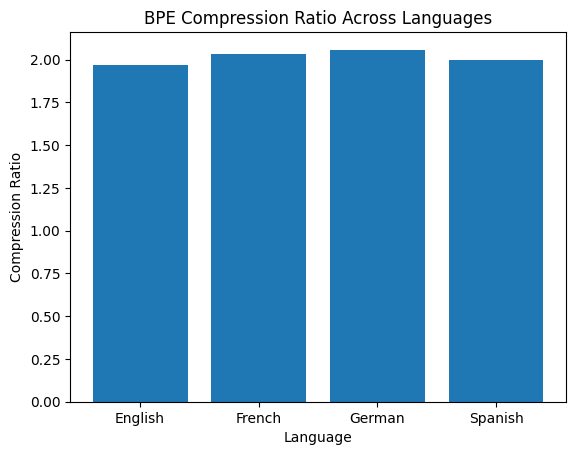
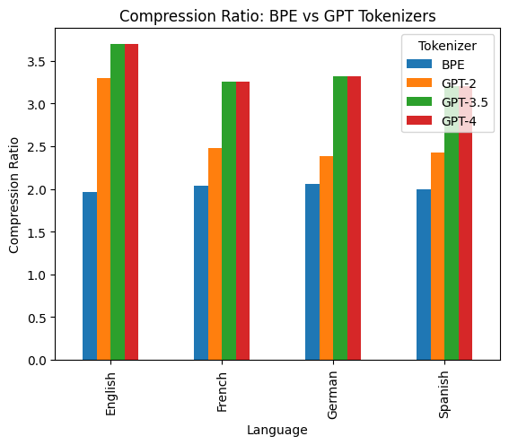
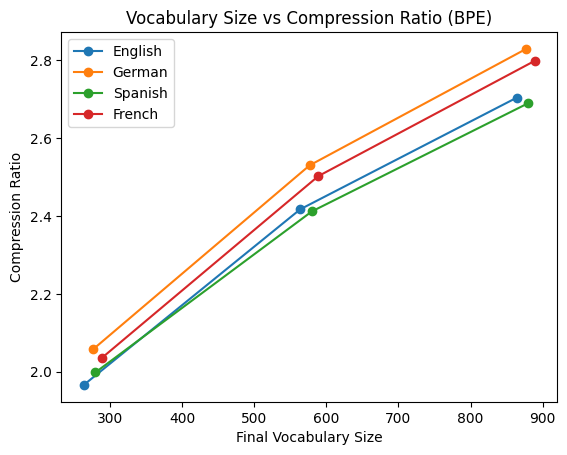
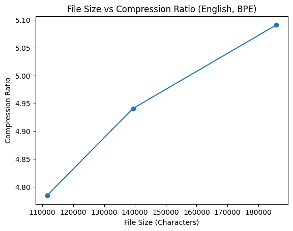

# Byte Pair Encoding (BPE) Tokenization & Compression Ratio Analysis Across Multiple Languages

[](https://www.python.org/)
[](LICENSE)
[](https://github.com/openai/tiktoken)

A from-scratch implementation of **Byte Pair Encoding (BPE)** tokenization and a
comparative study of its **compression efficiency** against modern GPT tokenizers
(GPT-2, GPT-3.5, GPT-4) across **English, German, Spanish, and French**.

> **Author:** Pratik Ramdas Sonawane · Vizuara Technologies
> **Full report:** [`report/BPE_Tokenization_Compression_Analysis.pdf`](report/BPE_Tokenization_Compression_Analysis.pdf)

---

## Table of Contents
- [Overview](#overview)
- [Research Questions](#research-questions)
- [Repository Structure](#repository-structure)
- [Installation](#installation)
- [Usage](#usage)
- [Methodology](#methodology)
- [Results](#results)
- [Key Findings](#key-findings)
- [Dataset](#dataset)
- [References](#references)
- [License](#license)

---

## Overview

**Compression ratio** measures how efficiently text is packed into tokens:

```
                    number of characters
Compression Ratio = ─────────────────────
                      number of tokens
```

A higher ratio means each token carries more characters → shorter sequences,
lower compute and memory cost, and more text fitting inside a fixed context
window. This project quantifies that ratio for a custom BPE tokenizer and
benchmarks it against the production GPT tokenizers.

## Research Questions

| # | Question |
|---|----------|
| **RQ1** | How do BPE compression ratios differ across English, German, Spanish, and French? |
| **RQ2** | How does language-specific BPE compare to general-purpose GPT tokenizers? |
| **RQ3** | What is the effect of vocabulary size on compression ratio? |
| **RQ4** | How does the amount of training data (file size) affect BPE compression? |

## Repository Structure

```
.
├── data/                                   # Parallel Shakespeare corpora (EN/DE/ES/FR)
│   ├── English Data.txt
│   ├── French Data.txt
│   ├── German Data.txt
│   └── Spanish Data.txt
├── figures/                                # Generated plots
│   ├── 01_bpe_compression_by_language.png
│   ├── 02_bpe_vs_gpt_tokenizers.png
│   ├── 03_vocab_size_vs_compression.png
│   └── 04_file_size_vs_compression.png
├── notebooks/
│   └── BPE_Compression_Ratio_Comparison_Research_Notebook.ipynb
├── report/
│   └── BPE_Tokenization_Compression_Analysis.pdf
├── src/
│   └── bpe_compression_report.py           # End-to-end reproduction script
├── requirements.txt
├── LICENSE
└── README.md
```

## Installation

```bash
# Clone
git clone https://github.com/Pratik2207/-Tokenization-and-Byte-Pair-Encoding.git
cd -Tokenization-and-Byte-Pair-Encoding

# (Optional) create a virtual environment
python -m venv .venv
source .venv/bin/activate        # Windows: .venv\Scripts\activate

# Install dependencies
pip install -r requirements.txt
```

## Usage

Run the full pipeline — learns BPE per language, compares against GPT
tokenizers, and regenerates every figure in `figures/`:

```bash
python src/bpe_compression_report.py
```

Or explore the analysis interactively:

```bash
jupyter notebook notebooks/BPE_Compression_Ratio_Comparison_Research_Notebook.ipynb
```

## Methodology

The BPE tokenizer is implemented from scratch (`src/bpe_compression_report.py`):

1. **Vocabulary construction** — each corpus is split into characters with an
   end-of-word marker `</w>`; every unique symbol receives a token id.
2. **Pair statistics** — frequencies of all adjacent symbol pairs are counted.
3. **Merge operations** — the most frequent pair is merged iteratively until the
   target vocabulary size is reached:

   `V(t+1) = V(t) ∪ { argmax_(a,b) freq(a, b) }`

4. **Compression ratio** — the corpus is re-tokenized with the learned merges and
   the character-to-token ratio is computed.
5. **GPT baseline** — the same corpora are tokenized with GPT-2, GPT-3.5, and
   GPT-4 encoders via `tiktoken` for a reference comparison.

Each language uses its **own vocabulary** to isolate inherent compressibility
and avoid cross-lingual interference.

## Results

### Task 1 — BPE compression ratios by language (200 extra merges)

| Language | Initial Vocab | Final Vocab | BPE Tokens | Compression Ratio |
|----------|--------------:|------------:|-----------:|------------------:|
| English  | 64  | 264 | 567,285 | 1.9662 |
| German   | 89  | 289 | 611,216 | 2.0355 |
| Spanish  | 77  | 277 | 624,089 | **2.0578** |
| French   | 90  | 280 | 586,954 | 1.9982 |



### Task 3 — BPE vs. GPT tokenizers

| Language | BPE | GPT-2 | GPT-3.5 | GPT-4 |
|----------|----:|------:|--------:|------:|
| English  | 1.9662 | 3.2997 | **3.6955** | **3.6955** |
| French   | 2.0355 | 2.4743 | 3.2586 | 3.2586 |
| German   | 2.0578 | 2.3882 | 3.3164 | 3.3164 |
| Spanish  | 1.9982 | 2.4216 | 3.1997 | 3.1997 |



### Task 4 — Effect of vocabulary size

Compression ratio rises consistently with vocabulary size across all languages.

| Language | ~264–289 | ~564–589 | ~864–889 |
|----------|---------:|---------:|---------:|
| English  | 1.9662 | 2.4171 | 2.7036 |
| German   | 2.0578 | 2.5299 | 2.8288 |
| Spanish  | 1.9982 | 2.4115 | 2.6895 |
| French   | 2.0355 | 2.5022 | 2.7982 |



### Task 5 — File size impact (English)

| Text Length (chars) | Final Vocab (5%) | Compression Ratio |
|--------------------:|-----------------:|------------------:|
| 111,539 | 5,636 | 4.7844 |
| 139,424 | 7,031 | 4.9410 |
| 185,899 | 9,355 | 5.0913 |



## Key Findings

- **Tokenizer hierarchy:** GPT-3.5 and GPT-4 outperform the from-scratch BPE on
  every language and metric, with ratios consistently above 3.0.
- **Vocabulary dependency:** Larger vocabularies (more merges) yield monotonically
  higher compression ratios — a clear efficiency/complexity trade-off.
- **File size matters:** For English, more training text raises the compression
  ratio (~4.78 → ~5.09 as the corpus grows from ~111k to ~186k characters).
- **Cross-lingual similarity:** The four Latin-script languages converge near a
  ratio of ~2.0 at 200 merges, with Spanish slightly ahead thanks to its regular
  morphology and German benefiting from compound words.

## Dataset

Parallel Shakespeare dramatic dialogue translated into four languages:

| Language | File | Description |
|----------|------|-------------|
| English | `data/English Data.txt` | Shakespeare dramatic dialogue text |
| German  | `data/German Data.txt`  | German-translated Shakespeare dialogues |
| Spanish | `data/Spanish Data.txt` | Spanish-translated Shakespeare dialogues |
| French  | `data/French Data.txt`  | French-translated Shakespeare dialogues |

## References

1. Gage, P. (1994). *A new algorithm for data compression.* The C Users Journal, 12(2), 23–38.
2. Radford, A., et al. (2019). *Language models are unsupervised multitask learners.* OpenAI Blog.
3. Brown, T., et al. (2020). *Language models are few-shot learners.* NeurIPS, 33, 1877–1901.
4. Sennrich, R., Haddow, B., & Birch, A. (2016). *Neural machine translation of rare words with subword units.* ACL, 1715–1725.
5. Xue, L., et al. (2021). *mT5: A massively multilingual pre-trained text-to-text transformer.* NAACL, 483–498.
6. Bostrom, K., & Durrett, G. (2020). *Byte pair encoding is suboptimal for language model pretraining.* Findings of EMNLP, 4617–4624.

## License

Released under the [MIT License](LICENSE).
